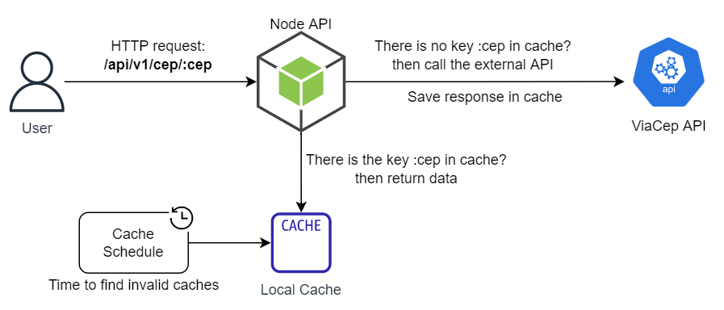
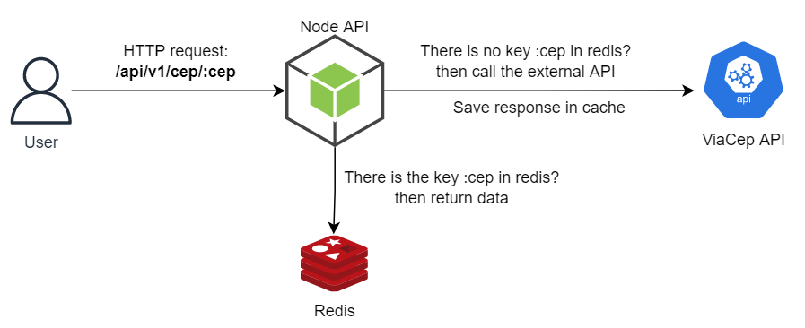

# Local and distributed caching strategies with Redis in Node.js

This is a project that implements local and distributed caching strategies
with Redis using Node.js and ViaCep API.

## 📐 Requirements

- Node.js
- Npm
- Redis (docker, docker-compose or install standalone service)

## 📖 Technologies

- [Node.js](https://nodejs.org) is an open-source, cross-platform JavaScript runtime environment.
- [Express.js](https://expressjs.com) is fast, unopinionated, minimalist web framework for Node.js.
- [Axios](https://axios-http.com/docs/intro) is a promise-based HTTP Client for node.js and the browser.
- [Nodemon](https://www.npmjs.com/package/nodemon) is a simple monitor script for use during development of a Node.js app.
- [Node-redis](https://www.npmjs.com/package//redis) is a modern, high performance Redis client for Node.js.
- [Node-scheduler](https://www.npmjs.com/package/node-schedule)  is a flexible cron-like and not-cron-like job scheduler for Node.js.

## 🚀 How to Run Local

Run docker-compose to start redis service

```shell
docker-compose up -d

npm start
```

You can try access the url: http://localhost:8080/api/v1/cep/01153000

Response:

```json
{
   "cep": "01153-000",
   "logradouro": "Rua Vitorino Carmilo",
   "complemento": "",
   "bairro": "Barra Funda",
   "localidade": "São Paulo",
   "uf": "SP"
}
```

## 🗼 Architecture

Our API has a class called `CacheServiceWrapper`
that will work as an orchestrator between the local and distributed
caches, as configured in the `REDIS_ENABLED` variable.

For the local cache, we have a scheduler with `Node-scheduler` library,
which will run every 1 minute to look for expired keys.

<p align="center">
  
  <br/>
  <span>Figure 1: Local cache structure</span>
</p>

<p align="center">
  
  <br/>
  <span>Figure 2: Distributed cache structure with redis</span>
</p>
